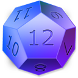

<h1 align="center"><br/><br/></h1>

[](https://ci.appveyor.com/project/virtyaluk/dice) [](https://www.nuget.org/packages/ModernDev.Dice/) [](https://gitter.im/modern-dev/dice?utm_source=badge&utm_medium=badge&utm_campaign=pr-badge&utm_content=badge)

# Dice

**Dice** - is a fake data generator for .NET.

```bash
PM> Install-Package ModernDev.Dice
```

## :clipboard: Usage

```csharp
var dice = new Dice();

// Generate random primitives
bool randBool = dice.NextBool();
char randChar = dice.NextChar();
string randStr = dice.NextString();

// Generate random sentence
var sentence = dice.NextSentence();

// Generate random city name
var city = dice.NextCity();

```

## :mortar_board: API Reference

### Embedded generators

```csharp
// Basic
dice.NextBool(likelihood: 50);                      // true
dice.NextInt(min: -500, max: 500);                  // -235
dice.NextLong(min: 0, max: 500);                    // 127
dice.NextNatural(min: 10, max: 300);                // 189
dice.NextChar(symbols: true);                       // "t"
dice.NextDouble(min: 0.0, max: 1.0, decimals: 4);   // 0.2364
dice.NextString(length: 7);                         // "datorex

// Text
dice.NextSyllable(length: 2, capitalize: false);    // "re"
dice.NextWord(capitalize: false, syllablesCount: 2);// "fane"
dice.NextSentence(wordsCount: 2, punctuation: true);// "Damy wilo."
dice.NextParagraph(sentencesCount: 2);              // "Damy wilo. Ride goke."

// Person
dice.NextAge(types: AgeRanges.Adult);               // 24
dice.NextCPF();                                     // "547.314.248-55"
dice.NextFirstName(isFemale: false);                // "John"
dice.NextLastName();                                // "Smith"
dice.NextSex();                                     // "Male"
dice.NextName(isMale: true, prefix: true);          // "Dr. Jerry Murphy"
dice.NextSSN(ssnFour: false, dashes: true);         // "354-65-4576"
dice.NextNameSuffix();                              // "Juris Doctor"
dice.NextNamePrefix(full: true, gender: "male");    // "Doctor"
dice.NextNationality();                             // "Dutch"

// Mobile
dice.NextAndroidId();                               // "APA91kEW1fYs7e-CUjoZl2ykG0I67TUNCUg5I3qfuSUO6E9CBOS25gvwxK5Dj3QXqtf9R1YUzm-cRlGwwF8AlLjKWq_Pflf_Nz7CUg8SDjQx9JFplrI0YYh9PlURsioMh0u0mfSC9yzR8828KkPcA1-Sl6CmPCMHYhbWEnL1hgR9aeTQzisqyHp"
dice.NextApplePushToken();                          // "23cc396d4b0375b2925e89b8604b047f3a73e5ef917d9e030c2eb810bf8c3a5d"
dice.NextWP7ANID();                                 // "A=E68C53BE05E25637A95EF4CF701572D9&E=012&W=5"
dice.NextBlackBerryPIN();                           // "237655c1"

// Web
dice.NextDomainName();                              // "cibtuzu.aq"
dice.NextTopLevelDomain();                          // "vi"
dice.NextEmail(domain: null, length: 8);            // "nidketsu@zeg.mg"
dice.NextGoogleAnalyticsId();                       // "UA-634818-71"
dice.NextHashtag();                                 // "#fipsec"
dice.NextIP();                                      // "201.71.14.122"
dice.NextIPv6();                                    // "cca3:e25d:1229:4f7e:d166:f878:be15:b2de"
dice.NextTwitterName();                             // "@re"
dice.NextUrl(protocol: "https");                    // "https://uhuavo.mw/zagajra"
dice.NextColor(format: ColorFormats.RGBA);          // "rgba(162,150,44,0.8257)"

// Location
dice.NextZipCode(plusFour: true);                   // "55445-9037"
dice.NextStreet(syllables: 2, shortSuffix: true);   // "Pircu Hts"
dice.NextState(fullName: false);                    // "WI"
dice.NextPostalCode();                              // "R65 8X0"
dice.NextLongitude(min: -180.0, max: 180.0);        // 63.4474
dice.NextLatitude(min: -90.0, max: 90);             // -59.34598
dice.NextGeohash(length: 7);                        // "frunwmv"
dice.NextCountry(fullName: true);                   // "Bhutan"
dice.NextCity();                                    // "Munsihto"
dice.NextAddress(syllables: 2, shortSuffix: true);  // "1183 Okhak Place"

// Date\Time
dice.NextYear(min: 1992, max: 2016);                // 2004
dice.NextMonth(min: 1, max: 12);                    // 5
dice.NextSecond();                                  // 26
dice.NextMinute(min: 0, max: 59);                   // 47
dice.NextHour(twentyfourHours: true);               // 3
dice.NextMillisecond();                             // 654
dice.NextDate(dateTimeMin, dateTimeMax);            // DateTime object

// Finance
dice.NextCurrency(returnCode: false);               // "Azerbaijan New Manat"
dice.NextCreditCardNumber();                        // "4260473867278166"

// Miscellaneous
dice.NextGUID(version: 5);                          // "85f16c07-4ea5-5d97-95f7-b8bab06a169b"
dice.NextHash(length: 40);                          // "25ac28d4559ca6a31a029df954d9ab1f127b9ecb"
```

### Embedded utils methods

##### NextList

Returns a list of n random terms using given generator function.

```csharp
var generator = new Func<string>(methodThatReturnsString);
var randomList = dice.NextList<string>(generator, 10);
```

##### GenerateUniqueList

Given a function that generates something random and a number of items to generate.

```csharp
var generator = new Func<int>(dice.NextNatural);
var listOfUniqueNumbers = dice.GenerateUniqueList<int>(generator, 10, 0, 1000);
```

##### ShuffleList

Given a list, scramble the order and return it.

```csharp
var shuffledList = dice.ShuffleList(new List<int> {1, 2, 3, 4, 5});
```

##### PickRandomItem

Given a list, returns a single random element.

```csharp
int randomItem = dice.PickRandomItem(new List<int> {1, 2, 3, 4, ,5 , 6, 7, 8, 9});
```

##### PickRandomSet

Given a list, returns a random set with **count** elements.

```csharp
List<int> randomSet = dice.PickRandomSet(new List<int> {1, 2, 3, 4, ,5 , 6, 7, 8, 9});
```

### Helpers

All the helpers methods belongs to the `Utils` static class.

##### LuhnCalcualte

Calculates checksum for credit card number using [:link:Luhn Algorithm](https://en.wikipedia.org/wiki/Luhn_algorithm).

```csharp
int cheksum = Utils.LuhnCalcualte(6304038511073827);
```

##### LuhnCheck

Checks whether the given credit card number is valid.

```csharp
bool isValid = Utils.LuhnCheck(6304038511073827);
```

##### NumberPadding

Pad a number with some string until it reaches a desired width.

```csharp
Assert.That(Utils.NumberPadding(45, 5, 'x'), Is.EqualTo("xxx45"));
```

##### DateTimeToUnixTimestamp

Converts `DateTime` object to Unix timestamp.

```csharp
long timestamp = Utils.DateTimeToUnixTimestamp(new DateTime(2016, 1, 1);
```

##### UnixTimestampToDateTime

Converts Unix timestamp to the `DateTime` object.

```csharp
DateTime dateTime = Unix.UnixTimestampToDateTime(1451606400);
```

### Seeding

**Dice** uses [:link:Mersenne Twister](https://en.wikipedia.org/wiki/Mersenne_Twister) pseudorandom number generator in core.

If you want to use a specific seed in order to get a repeatable random sequence:

```csharp
var dice = new Dice(123);
```

You may use your own generator function in order to get a repeatable random sequence:

```csharp
var dice = new Dice(new Func<double>(randomGenFunc));
```

## :green_book: License

Heavily inspired by [https://github.com/chancejs/chancejs/](https://github.com/chancejs/chancejs/).
The icon was taken from [here](http://findicons.com/pack/2200/dices).

[Licensed under the MIT license.](https://github.com/virtyaluk/InTouch/blob/master/LICENSE)

Copyright (c) 2017 Bohdan Shtepan

---

> [modern-dev.com](http://modern-dev.com) &nbsp;&middot;&nbsp;
> GitHub [@virtyaluk](https://github.com/virtyaluk) &nbsp;&middot;&nbsp;
> Twitter [@virtyaluk](https://twitter.com/virtyaluk)
